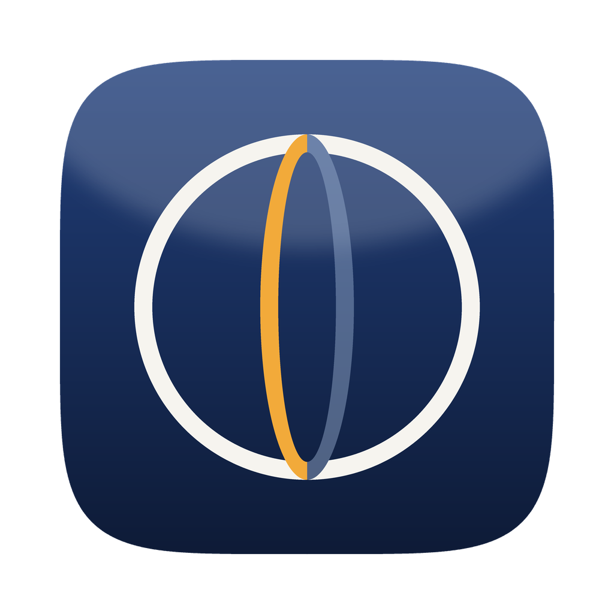

<div align="center">



# Meridian

**여러 장의 사진을 하나의 파노라마로 잇는 데스크톱 앱**

[](https://github.com/doozymalen/meridian/actions/workflows/build.yml)
[](LICENSE)
[](#설치)

</div>

---

자동으로 붙여 주고 끝나는 도구가 아니라, **결과를 손으로 통제하는 도구**를 목표로 한다.
제어점을 직접 찍고, 렌즈 왜곡과 화각을 숫자로 다루고, 이음선이 어디를 지나는지 고른다.
360×180 구면 파노라마와 기가픽셀 출력까지 다룬다.

## 목차

- [주요 기능](#주요-기능)
- [설치](#설치)
- [쓰는 순서](#쓰는-순서)
- [화면](#화면)
- [구조](#구조)
- [직접 빌드하기](#직접-빌드하기)
- [개발](#개발)
- [알아 둘 것](#알아-둘-것)
- [라이선스](#라이선스)

## 주요 기능

**입력**

- JPEG · TIFF · PNG 와 카메라 RAW (`.ARW .CR2 .CR3 .NEF .DNG .RAF .ORF .RW2` 등)
- EXIF 에서 렌즈 이름·초점거리·35mm 환산값을 읽어 화각을 추정한다.
  캐논 CR3 는 컨테이너 구조가 달라 따로 파싱한다
- 같은 렌즈로 찍은 사진은 자동으로 묶어 파라미터를 공유한다

**정렬**

- RootSIFT 특징점 + 전역 FLANN 인덱스로 겹치는 쌍을 찾는다.
  이미지 수가 아니라 특징점 수에 비례하므로 수백 장도 감당한다
- 번들 조정으로 모든 카메라의 yaw/pitch/roll, 화각, 방사 왜곡(a·b·c), 주점 이동을 동시에 푼다
- 제어점을 직접 찍을 수 있고, 한쪽을 클릭하면 반대쪽 짝을 찾아 준다
- 수직선·수평선 제어점으로 건축 사진의 기울기를 잡는다

**투영**

구면(equirectangular) · 원통 · 직선 · 메르카토르 · 스테레오 · 어안,
그리고 **리틀 플래닛** / **터널** 프리셋. 출력 화각(가로·세로)을 고정할 수 있어,
방향을 돌려도 틀이 흔들리지 않는다.

**합성** — 보정은 모두 꺼진 채로 시작한다. 필요한 것만 눈으로 보며 켠다.

- **비네팅·미광 보정** — 겹침에서 `관측 = 실제밝기 × V(r) × 노출 + 미광` 을 푼다.
  `V(r) = 1 + a·r² + b·r⁴ + c·r⁶`. 미광(렌즈 내부 산란광)은 더해지는 성분이라
  배율만으로는 절대 맞출 수 없다. 곡선에는 단조 감소·매끄러움 제약을 건다
- **노출·화이트밸런스 맞춤** (이미지별 게인)
- **밝기 기울기 맞춤** — 이미지 *안에서* 완만하게 변하는 차이를 서로 맞춘다.
  하늘처럼 매끄러운 면에 생기는 쐐기 모양 얼룩을 없애는 단계다
- **이음선 찾기** — 먼저 거리 변환으로 크게 나누고 그 다음 다듬는다.
  천정처럼 모든 사진의 가장자리가 모이는 곳에서 쌍끼리 이음선을 찾으면 경계가 잘게
  쪼개지고, 구름처럼 장마다 모습이 다른 대상이 조각조각 맞붙어 원호 모양 경계로
  드러난다. 거리 분할은 한 사진이 넓은 면을 통째로 맡게 해 그 문제를 없앤다
- **멀티밴드 블렌딩**

**출력**

- 가로 픽셀을 직접 지정하거나 배율(5~400%)로. 상한은 없다
- JPEG · TIFF(LZW) · PNG(투명 포함)
- 기가픽셀 출력은 타일 스트리밍으로 렌더한다. 캔버스를 디스크에 memmap 으로 잡으므로
  16GB 맥에서도 수십억 화소를 낸다
- 구면 파노라마에는 GPano/XMP 메타데이터를 심는다. 파노라마 뷰어가 바로 알아본다

## 설치

[Releases](https://github.com/doozymalen/meridian/releases/latest) 에서 내려받는다.

### macOS (Apple Silicon, 11 Big Sur 이상)

`Meridian-mac.dmg` 를 열고 `Meridian` 을 옆의 응용 프로그램 폴더로 끌어다 놓는다.

### Windows (10 1809 이상, x64)

`Meridian-Setup.exe` 를 실행해 설치한다. 관리자 권한은 묻지 않고, 시작 메뉴와
바탕화면에 Meridian 이 생긴다. 지울 때는 윈도우의 "앱 제거"에서 지운다
(저장한 프로젝트는 남는다).

> [!NOTE]
> 서명이 없어서 처음 실행할 때 macOS 와 Windows 가 각각 한 번 막는다.
> macOS 는 시스템 설정 → 개인정보 보호 및 보안 → "그래도 열기",
> Windows 는 "추가 정보" → "실행"을 누르면 된다.

## 쓰는 순서

1. **사진 추가** — 창 어디에나 끌어다 놓거나 툴바의 `+` 로 고른다. 폴더째 넣어도 된다
2. **자동 정렬** — 특징점을 찾아 제어점을 만들고, 카메라 자세·화각·렌즈 왜곡을
   한꺼번에 푼다. 끝나면 렌즈 비네팅도 잰다
3. **방향과 화각을 잡는다** — 미리보기를 끌어서 돌리거나 숫자로 넣는다.
   설정을 바꿔도 바로 그리지 않는다. 다 고른 뒤 **미리보기 갱신**(⌘Y)을 누른다
4. 어긋난 자리가 있으면 **제어점** 화면에서 손으로 점을 찍거나 나쁜 점을 끈다
5. **내보내기** — 원본 해상도로 렌더해 파일로 쓴다

## 화면

세 칸으로 나뉜 창 하나다.

| 칸 | 내용 |
|---|---|
| 왼쪽 | 사진 목록. 파일 이름·화소 수·RAW 여부·기준 사진. 오른쪽 눌러 빼거나 기준으로 바꾼다 |
| 가운데 | 파노라마 미리보기와 제어점 편집기 (⌘1 / ⌘2 로 오간다) |
| 오른쪽 | 투영·방향·화각·합성·렌즈·출력. 작업 내내 보면서 쓰는 곳이라 접히지 않는다 |

**미리보기를 끌면 파노라마가 돌아간다.** 왼쪽 끌기는 좌우·상하, 오른쪽(또는 ⌥) 끌기는
기울기다. 끄는 동안은 전방위 원판을 다시 펼쳐 바로 보여 주고, 손을 떼면 정식으로 그린다.

### 제어점 편집기

자동 정렬이 어긋난 자리를 직접 이어 주는 곳이다.

- 왼쪽 사진을 클릭하면 오른쪽에서 짝을 찾아 준다. 자신 없으면(일치도 0.45 미만)
  예측 위치로 화면만 옮겨 주고 사람이 찍게 둔다
- ⌥클릭으로 양쪽을 직접 지정, 점을 고른 뒤 ⌫ 로 삭제
- 커서 밑을 6배로 비추는 **확대경** — 한 화소를 다투는 작업이라 이게 없으면 정확히 찍을 수 없다
- 마커 색이 곧 잔차다: 청록(양호) · 주황(5px 초과) · 빨강(12px 초과)

## 구조

엔진과 화면이 분리돼 있다. 화면은 엔진과 **HTTP 로만** 대화하고, 엔진을 자식 프로세스로
띄운다. 화면이 끝나면 엔진도 같이 정리된다. 원본 사진은 언제나 있던 자리에서 읽는다.

```
meridian/          엔진 (파이썬) — 플랫폼 공용
  camera.py        카메라·렌즈 모델, 투영 수학 (픽셀 ↔ 광선 ↔ 파노라마)
  images.py        RAW 디코딩, EXIF, 프록시 캐시
  features.py      SIFT 검출·매칭, 자동 제어점
  optimize.py      번들 조정, 초기값 추정, 수평 맞추기
  photometric.py   비네팅·노출 추정
  warp.py          캔버스 배치와 워핑
  blend.py         노출 보정, 밝기 기울기 맞춤, 이음선, 블렌딩
  render.py        미리보기와 타일 스트리밍 최종 렌더
  live.py          끌어서 돌릴 때 쓰는 빠른 재투영
  xmp.py           GPano 메타데이터
  project.py       프로젝트 상태와 저장
  server.py        로컬 HTTP API
mac/Sources/       macOS 화면 (Swift · AppKit)
winui/             Windows 화면 (C# · WinUI 3)
web/              브라우저 화면 (바닐라 JS) — 엔진만 띄워 쓸 때
windows/           Windows 진입점과 빌드 스크립트
```

좌표 규약과 왜곡 모델의 방향 같은 전제는 각 모듈 맨 위 주석에 적어 두었다.

## 직접 빌드하기

### macOS

[uv](https://docs.astral.sh/uv/) 가 필요하다.

```bash
./build_app.sh              # dist/Meridian.app (약 360MB, 파이썬 런타임 포함)
open dist/Meridian.app
```

만들어진 `.app` 은 자립적이라 파이썬이 없는 맥에 복사해도 그대로 돈다.
코드만 고쳤으면 `./build_app.sh --code-only` 가 몇 초 만에 끝난다.

> Intel 맥까지 담은 universal 바이너리는 x86_64 용 Swift 호환성 라이브러리가 필요한데,
> Command Line Tools 에는 arm64 슬라이스만 들어 있어 빌드되지 않는다. Xcode 가 있으면
> `MERIDIAN_UNIVERSAL=1 ./build_app.sh` 로 시도할 수 있다.

### Windows

파이썬 실행 파일은 교차 빌드가 되지 않는다. 맥에서 `.exe` 를 만들 수 없고 그 반대도
마찬가지다. 그래서 이 저장소는 **GitHub Actions 의 윈도우·맥 러너**에서 두 판을 함께 빌드한다
([`.github/workflows/build.yml`](.github/workflows/build.yml)). PR 마다 돌고,
`Actions → 앱 빌드 → Run workflow` 로 직접 돌릴 수도 있다.

### 릴리스

`v*` 태그를 올리면 두 판을 빌드해 릴리스를 만들고 `Meridian-Setup.exe`,
`Meridian-mac.dmg` 를 붙인다. 태그 번호가 설치 프로그램의 버전이 된다. 둘 중 하나라도 실패하면 릴리스는 만들지 않는다.

```bash
git checkout main && git pull
git tag v1.0.0 && git push origin v1.0.0
```

깃허브 화면에서 `Releases → Draft a new release` 로 새 태그를 만들어도 된다.
앱 안의 버전 번호는 `build_app.sh` 의 Info.plist 에 있다.

윈도우 PC 가 있다면 PowerShell 에서 직접 해도 된다.

```powershell
.\windows\build_windows.ps1                        # 엔진 (dist\Meridian\)
# 화면은 비주얼 스튜디오의 msbuild 로 ('개발자용 PowerShell for VS' 에서)
msbuild winui\Meridian.WinUI.csproj /restore /t:Publish `
  /p:Configuration=Release /p:Platform=x64 /p:RuntimeIdentifier=win-x64 `
  /p:SelfContained=true /p:PublishDir=$PWD\publish\
Copy-Item -Recurse dist\Meridian\* publish\engine\  # 화면이 엔진을 자식으로 띄운다
```

자세한 것은 [docs/windows.md](docs/windows.md).

## 개발

엔진만 띄워 브라우저에서 쓰려면:

```bash
./run.sh          # http://127.0.0.1:8756
```

엔진은 화면 없이도 돌아간다. HTTP API 하나로 전부 다루므로, 다른 화면을 붙이거나
스크립트로 자동화하기 쉽다.

```
POST /api/images/add          사진 추가            POST /api/align      자동 정렬
POST /api/preview             미리보기 (작업)       POST /api/render     내보내기 (작업)
PATCH /api/settings           투영·화각·합성 설정   GET  /api/layout     지금 설정의 출력 크기
POST /api/live/frame          끄는 동안의 한 장     POST /api/job/{id}/cancel  작업 취소
```

오래 걸리는 것은 작업(job)으로 돌아간다. `{"job": "<id>"}` 를 받아
`GET /api/job/<id>` 로 진행률을 읽는다.

화면을 직접 볼 수 없는 자리에서 macOS 레이아웃을 점검할 때 쓰는 것들:

```bash
MERIDIAN_DUMP_LAYOUT=1 ./dist/Meridian.app/Contents/MacOS/Meridian   # 각 칸의 실제 크기
MERIDIAN_TRACE=1            # 사진을 물리고 그리는 호출을 따라간다
MERIDIAN_START_MODE=cp      # 제어점 화면으로 바로 연다
MERIDIAN_PROJECT=<절대경로>  # 저장해 둔 프로젝트를 열고 시작한다
MERIDIAN_WORKERS=4          # 내보낼 때 동시에 그릴 타일 수
MERIDIAN_DATA=<경로>         # 캐시·프로젝트를 둘 곳 (윈도우 기본: %LOCALAPPDATA%\Meridian)
```

## 알아 둘 것

- 노달 포인트를 맞추지 않고 찍으면 가까운 물체에서 시차가 생긴다.
  스티칭으로는 지울 수 없으니 촬영 때 잡아야 한다
- 구름이 움직이거나 사람이 지나간 자리는 이음선이 그 위를 지나지 않게 방식을 바꿔 보는
  편이 낫다. 하늘이 지저분하면 '거리 분할만' 을 골라 한 사진이 더 넓은 면을 맡게 하면
  대개 정리된다
- 사진이 덮지 않은 곳은 기본적으로 비워 둔다. 어디를 못 찍었는지 보이는 편이 낫기
  때문이다. **빈 곳 채우기**를 켜면 주변 색으로 메우지만, 실제로 찍힌 내용은 아니다
- OpenCV 5 의 `VoronoiSeamFinder` 와 `NoSeamFinder` 는 파이썬 바인딩에서 세그폴트가 난다.
  그래서 선택지에 두지 않았다

## 라이선스

[MIT](LICENSE). 배포물에는 아래가 함께 들어간다.

| 구성 요소 | 라이선스 | 비고 |
|---|---|---|
| OpenCV (opencv-contrib-python-headless) | Apache-2.0 | 특징점·합성 |
| NumPy, SciPy | BSD-3-Clause | 수치 계산 |
| rawpy / LibRaw | MIT / LGPL-2.1 (LibRaw) | RAW 현상. LGPL 이므로 라이브러리를 고쳤다면 그 소스를 함께 제공해야 한다 |
| FastAPI, uvicorn, Pillow, exifread | MIT / BSD | 서버와 이미지 입출력 |
| CPython | PSF | 번들에 포함 |
| Windows App SDK | MIT | Windows 화면 |
